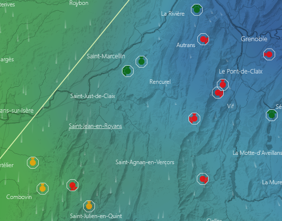
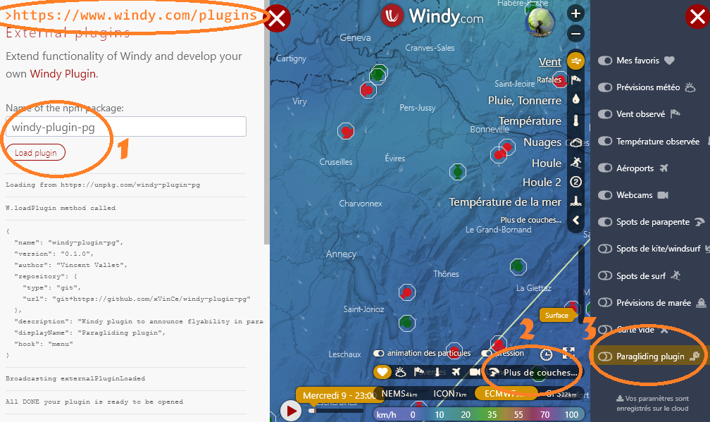

# Windy paragliding plugin
This plugin adds icons to the map indicating takeoffs, with the flyability of each site based on the weather forecast.

**This plugin's goal is to help paragliders in choosing a take-off that suits the weather forecast. It is only intented as a tool. In no way this plugin replaces the full weather analysis any pilot needs to do before taking off from anywhere**

In the current version (0.1.0), flyability of a site is determined as follows:
- Wind has to come from a direction that is appropriate for the takeoff
- Wind has to be less to 5m/s (green icon) or 8m/s (orange icon)

## How to use?
1. Go to https://www.windy.com/plugins and load windy-plugin-pg
2. Click on "More layers" in the lower right corner of the map, the list of available layers should appear
3. Click on "Paragliding plugin" in the list
4. Zoom until you see paragliding site icons

## Features
- Displays sites only at a certain zoom level
- Displays the orientation of each site on the icon

## Limitations
- /!\ For the flyability feature, only takes wind into account, doesn't take wind gusts, visibility or rain for example.
- Only works with Wind overlay, displays grey icons with other overlays
- Only works for alpine sites at the moment. Soaring sites are displayed, but flyability doesn't take into account the minimum wind.

## Next steps
- Improve icon management (smaller icons when low zoom, bigger icons when zooming)
- Add a tooltip with site infos on hover (like Windy's basic PG plugin)
- Performance improvements (avoid reloading already loaded sites from the API, avoid re-drawing already drawn icons)
- Manage Soaring sites properly
- Display landings and takeoffs with an unknown orientation
- Add a link to Google map for driving instructions
- Improve flyability with wind gusts, rain and visibility, and make it work with any overlay
